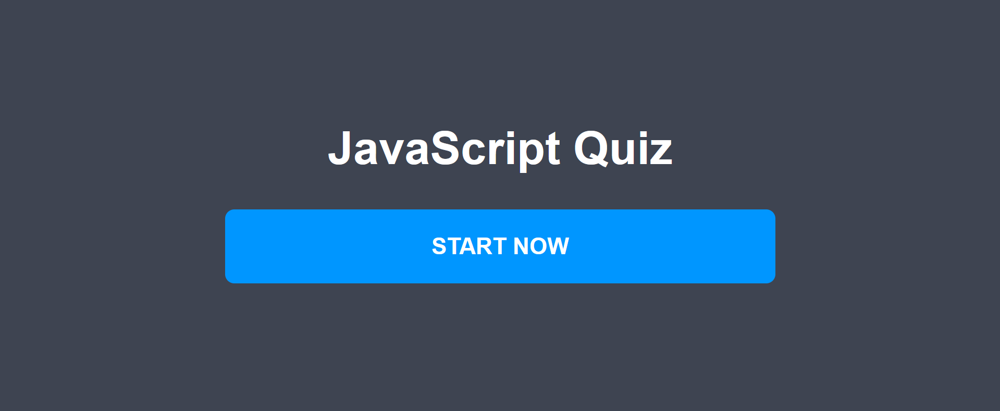
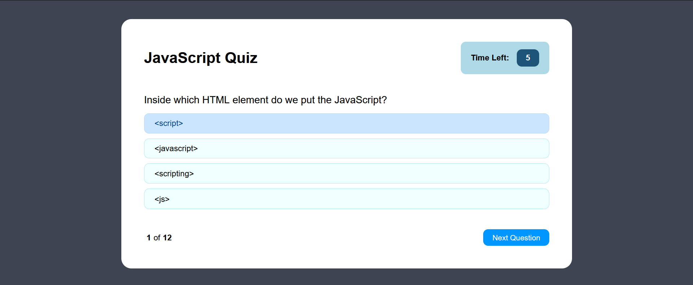
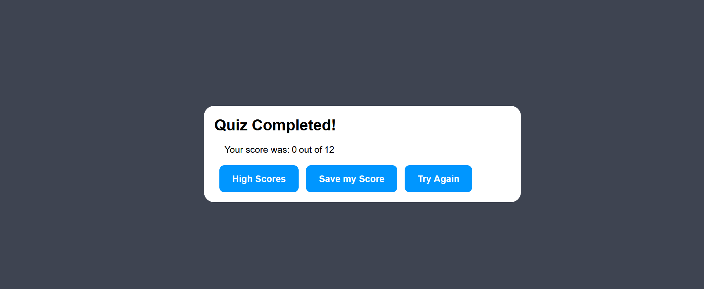

# JavaScript Coding Quiz

# Description
Quizzes are a quick and easy way to test our knowledge of a certain subject. Which is why this JavaScript quiz was created, and what better way to test my JavaScript knowledge than to make a whole quiz about it!

## Usage
As mentioned previously, this website was made using JavaScript but also HTML and CSS. The way it works is that you are presented with the main page where the name of the quiz is shown and a big start button. Once that is pressed you are immediatly taken to the quiz. There is a total of 12 questions and you have 15 seconds for each question. You may pick whichever answer you feel is best, but be careful, because clicking the wrong answer will subtract 2 seconds from the timer. Once you're confident with your answer, click the next question button. At the bottom left you will notice which question out of the 12 questions you are on. Once you reach the end, you will be shown your score which you can save your score by pressing save score and will be prompted to enter your initials. You may see others that have entered their scores, or try again. 

## Images

## Link
Wanna test out your JavaScript knowledge, [test it out here](https://maxmruiz.github.io/JS-quiz/).